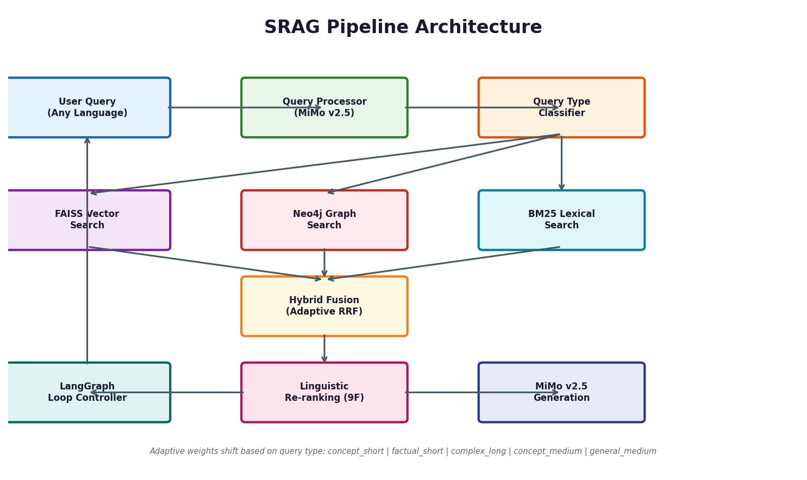

# SansRAG — Sanskrit RAG with Graph-Enhanced Linguistic Re-ranking

A hybrid Retrieval-Augmented Generation system for the **Bhagavad Gita**, combining vector search, knowledge graph traversal, and BM25 lexical matching with adaptive re-ranking, feature normalization, and LangGraph orchestration.

## Architecture



```
User Query (any language)
  ↓ QueryProcessor (MiMo v2.5)
  ├── Language detection (English/Hindi/IAST/Devanagari)
  ├── IAST conversion + concept extraction (26 concepts)
  └── Query type classification (5 types)
  ↓
  ├── Vector Search (FAISS + bge-m3-sanskritFT)
  ├── Graph Search (Neo4j: full-text + concept traversal)
  └── BM25 Search (rank-bm25 + Sanskrit suffix expansion)
  ↓ Hybrid Fusion (Adaptive RRF weights per query type)
  ↓ Linguistic Re-ranking (9 features + minmax/l2/zscore normalization)
  ↓ LangGraph Loop (expand query if confidence < 0.3, max 2 iterations)
  ↓ Answer Generation (MiMo v2.5 — explanation-first, commentaries at end)
  ↓
Response: answer (markdown) + citations + commentaries + confidence + pipeline stages
```

Full architecture details: [docs/architecture.md](docs/architecture.md)

## Quick Start

### Prerequisites

- Python 3.11+
- Neo4j 5.x running on `bolt://localhost:7687`
- MiMo API key (in `.env` as `MIMO_API_KEY`)
- ~4 GB RAM for embedding model

### Setup

```bash
# Install dependencies
pip install -r requirements.txt

# Create .env file
echo "MIMO_API_KEY=your_key_here" > .env

# Preprocess XML corpus (3507 chunks across 18 chapters)
python main.py preprocess

# Build Neo4j knowledge graph
python main.py build-graph

# Build FAISS + BM25 indices (~75 min on CPU)
python main.py build-indices

# Migrate commentaries to SQLite
python migrate_commentaries.py
```

### Query

```bash
# Standard pipeline
python main.py query --query "What is dharma?"

# LangGraph pipeline (iterative expansion)
python main.py query --query "What is dharma?" --langgraph

# Local fallback (no MiMo API)
python main.py query --query "What is dharma?" --local
```

### Web UI

```bash
# Start API server + React frontend
python api_server.py
# Open http://localhost:8000
```

The UI includes:
- Ancient parchment theme (IM Fell English, sepia tones, quill icon)
- Collapsing side panel showing all 5 pipeline stages
- Toggle switches for retrieval methods (Vector/Graph/BM25)
- Feature normalization dropdown (none/minmax/l2/zscore)

## Project Structure

```
SansRAG/
├── configs/config.yaml              # All configuration
├── data/
│   ├── raw/                         # Source XML files
│   ├── processed/                   # Chunks, FAISS index, graph import
│   ├── storage/commentaries.db      # SQLite commentary store
│   └── evaluation/                  # QA datasets + evaluation reports
│       ├── external/
│       │   ├── gita_guidance_qa.jsonl    # 711 modern-life QA pairs
│       │   ├── edwin_arnold_qa.jsonl     # 500 factual QA pairs
│       │   ├── hf_gita_qa.jsonl          # 3500 HuggingFace verse QA
│       │   ├── kaggle_gita_qa.jsonl      # 12902 modern-life QA pairs
│       │   └── iskcon_vedabase.jsonl     # 657 ISKCON commentaries
│       ├── eval_unnormalized.json        # Baseline evaluation results
│       ├── eval_normalized.json          # MinMax normalization results
│       └── normalization_comparison.json # Side-by-side comparison
├── src/
│   ├── preprocessing/               # XML parsing, chunking, concept extraction
│   ├── retrieval/                   # Vector (FAISS), BM25, Neo4j graph
│   ├── reranking/                   # 9-feature adaptive re-ranking + normalization
│   ├── generation/                  # MiMo prompt templates + generation
│   ├── langchain_components/        # LangGraph state machine
│   ├── storage/                     # SQLite commentary store
│   └── utils/                       # Config, logger
├── tests/                           # 69 tests across 5 modules
├── web/                             # React + Vite frontend (parchment theme)
├── main.py                          # CLI entry point
├── api_server.py                    # FastAPI backend
├── migrate_commentaries.py          # Populate SQLite from chunks
├── evaluate.py                      # Single-dataset evaluation
└── evaluate_comprehensive.py        # 5-dataset evaluation with normalization
```

## How It Works

### 1. Query Processing
MiMo v2.5 converts any language query to IAST, extracts philosophical concepts (dharma, karma, yoga, etc. from 26 concepts), and classifies query type into 5 categories.

### 2. Hybrid Retrieval
Three parallel searches with adaptive weights:
- **FAISS Vector**: Semantic search using Sanskrit-fine-tuned embeddings (bge-m3-sanskritFT)
- **Neo4j Graph**: Full-text search + concept neighborhood traversal
- **BM25 Lexical**: Sanskrit suffix-aware tokenization with lemma expansion

### 3. Fusion
Weighted Reciprocal Rank Fusion (RRF) merges results from all three retrievers. Weights adapt per query type.

### 4. Re-ranking
9 linguistic features with feature normalization:
- Vector score, graph score, BM25 score
- Lemma overlap, morphological match, compound match
- Commentary consensus, concept overlap, graph centrality

Features are normalized (minmax/l2/zscore) before weighted combination to handle different scales.

### 5. Answer Generation
MiMo v2.5 generates structured markdown answers. Prompt enforces:
- Explanation-first (model's own synthesis)
- Verses as evidence (1-2 line quotes with explanation)
- Commentaries as appendix (single most relevant at end)

### 6. LangGraph Orchestration
State machine with 5 nodes and conditional routing:
```
process_query → retrieve → fuse → rerank → [expand?] → generate → END
                                    ↑
                                    └── expand (confidence < 0.3, max 2 iterations)
```

## Adaptive Query Types

| Query Type | Example | Vector | Graph | BM25 |
|-----------|---------|--------|-------|------|
| `concept_short` | "What is dharma?" | 0.45 | 0.20 | 0.05 |
| `factual_short` | "Who is Krishna?" | 0.35 | 0.30 | 0.08 |
| `complex_long` | Long philosophical question | 0.35 | 0.15 | 0.20 |
| `concept_medium` | "Explain karma yoga" | 0.40 | 0.22 | 0.08 |
| `general_medium` | Default | 0.40 | 0.18 | 0.12 |

## Feature Normalization

The 9 re-ranking features have different scales (BM25 is unbounded, others are 0-1). Normalization methods:

| Method | Description | Best For |
|--------|-------------|----------|
| `minmax` | Scales each feature to [0, 1] across candidates | General use (default) |
| `l2` | Normalizes feature vectors to unit length | Direction over magnitude |
| `zscore` | Standardizes to zero mean, unit variance | Outlier handling |
| `none` | Raw scores, no normalization | Baseline comparison |

Toggle via config (`reranking.normalize`), API (`normalize` param), or UI dropdown.

## Evaluation Results

### 5 Datasets (10 samples each, 50 total)

#### Unnormalized (baseline)

| Dataset | Samples | Avg Semantic Sim | High | Med | Low |
|---------|---------|-----------------|------|-----|-----|
| HuggingFace Gita QA | 10 | 0.6560 | 9 | 1 | 0 |
| Kaggle Gita QA | 10 | 0.4979 | 6 | 4 | 0 |
| Gita Guidance QA | 10 | 0.4449 | 1 | 9 | 0 |
| Edwin Arnold QA | 10 | 0.3548 | 2 | 5 | 3 |
| ISKCON VedaBase | 10 | 0.3224 | 0 | 6 | 4 |
| **Overall** | **50** | **0.4552** | **18** | **25** | **7** |

#### Normalized (minmax)

| Dataset | Samples | Avg Semantic Sim | High | Med | Low | Diff |
|---------|---------|-----------------|------|-----|-----|------|
| HuggingFace Gita QA | 10 | 0.6802 | 9 | 1 | 0 | **+0.024** |
| Kaggle Gita QA | 10 | 0.5014 | 5 | 4 | 1 | **+0.004** |
| Gita Guidance QA | 10 | 0.4437 | 4 | 5 | 1 | -0.001 |
| Edwin Arnold QA | 10 | 0.2916 | 1 | 3 | 6 | -0.063 |
| ISKCON VedaBase | 10 | 0.2591 | 0 | 6 | 4 | -0.063 |
| **Overall** | **50** | **0.4352** | **19** | **19** | **12** | -0.020 |

**Conclusion**: MinMax normalization helps for verse-specific (+2.4%) and modern-life (+0.4%) queries. Default is `minmax`.

Run your own evaluation:
```bash
# Unnormalized
python evaluate_comprehensive.py --samples 20 --normalize none

# Normalized
python evaluate_comprehensive.py --samples 20 --normalize minmax
```

## Tests

```bash
pytest tests/ -v
# 69 passed
```

## Tech Stack

- **Embeddings**: `sanganaka/bge-m3-sanskritFT` (FAISS, 1024-dim)
- **Retrieval**: FAISS + Neo4j 5.x + rank-bm25
- **Re-ranking**: 9-feature adaptive scoring with normalization
- **Commentary Store**: SQLite (627 verses, 1440 commentaries)
- **Generation**: MiMo v2.5 (via OpenAI-compatible API)
- **Orchestration**: LangGraph state machine (5 nodes, conditional routing)
- **Backend**: FastAPI
- **Frontend**: React + Vite (ancient parchment theme, pipeline inspector)

## Full Report

See [docs/SRAG_Project_Report.pdf](docs/SRAG_Project_Report.pdf) for the detailed project report with diagrams.
